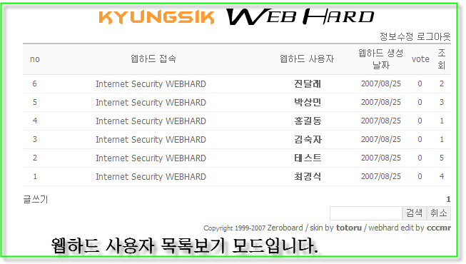

  

# [웹하드 서비스 게시판 스킨](http://090111.tistory.com/entry/%EC%9B%B9%ED%95%98%EB%93%9C)
## 개요
- 스킨명 : cccmr_webhard  
- 만든이: 토토루 (  [http://rwapm.com](http://rwapm.com/)  ) / 최경식(  [http://info.jaaaj.com](http://info.jaaaj.com/))

## 안내
- 본 소스의 무단배포를 금합니다.
- cccmr_webhard는 ie 6.0 , Opera 9.0 , Firefox 1.5.0.6 브라우저에서 테스트 되었습니다. 


## 특징  
- 웹하드 기능  
- 업로드 파일명을 md5 해쉬화함.  
- 한글파일도 문제없이 업로드 가능합니다.

이것은 웹하드 서비스 게시판 스킨입니다. 보안유지는 필수 입니다. 웹하드 소유주만 다운로드가 가능하고, 남이 다운로드 할수 없어야 합니다. 웹하드 서비스 게시판 스킨은 업로드 파일을 md5해쉬화 되어 원본파일을 알수없도록 저장합니다. 비록 완벽한 100%의 보안은 아닙니다만, 그래도 가장 보안에 안전하다고 생각합니다.

## 설치 방법

1. 첨부된 파일을 내려받아 압축해제후 cccmr_webhard를 skin폴더안에 올립니다.  
   - 다들 알고 계시죠? 스킨의 기본적인 설치법입니다.

  
2. 먼저 관리자로 로그인후 아래 주소로 접근합니다.  
   - http://홈주소/제로보드/skin/muti_board/muti_db.php

  
3. 개인 설정
   1. cccmr_webhard 스킨의 write.php파일을 엽니다.  
   2. 80번째 줄의 맨 끝에 보시면 
```....style="width:99%">웹하드 정보</textarea>```
이런 내용이 있습니다.  
   3. 여기의 "웹하드 정보"부분을 지우고 자신이 운영할 웹하드의 정보를 입력합니다.  한사람당 웹하드 용량을 x기가로 한다는지, html,php의 파일 업로드를 금지한다든지 그런 내용을 적으시면 됩니다.

  
4. 제로보드 폴더의 view.php파일을 엽니다. (스킨 폴더 아님)  
　191 번째 줄에 아래와 같은 내용을 삽입합니다.

```
// (멀티업로더) 파일 삭제 버튼  
if(($is_admin||$member[level]<=$setup[grant_delete]||$data[ismember]==$member[no]||!$data[ismember])&&$no) $a_upfiledel="<a onfocus=blur() href='write.php?$href$sort&no=$no&mode=upfiledel'>"; else $a_upfiledel="<Zeroboard ";
```

- 웹하드에 올려진 파일을 삭제하는 기능 구현을 위한겁니다.  
- 원래 write.php에는 기본 글쓰기 모드, reply(답글모드), modify(수정모드)가 있는데  이 웹하드 스킨은 upfiledel이라는 모드를 추가적으로 사용합니다.  제로보드 사용이나 다른 스킨에 전혀 영향을 끼치지 않습니다.  




